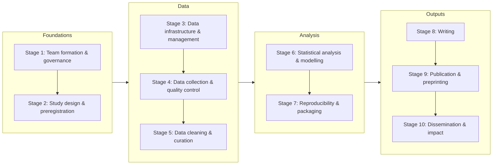

# Big Team Science Tools by Workflow Stage

*CONNECT Tools & Infrastructure Working Group · Presented at BTSCon 2026*

[TOC]

## About This Resource

Big team science (BTS) projects run on a lot of tools, and many good ones are under the radar. This page maps tools onto each stage of a BTS project, from forming a team to sharing results, so you can see what's available and pick what fits your team.

It started from the "101 Innovations" research workflow ([Kramer & Bosman, 2016](https://doi.org/10.12688/f1000research.8414.1)), adapted for large, distributed, multi-site collaborations. It is **a living document**, so please add to it (see [How to Contribute](#How-to-Contribute)).

### Cost Key

| | Meaning |
|---|---|
| 🟢 **Open source** | Free, with source code available; can often be self-hosted |
| 🔵 **Free** | No cost for academic use, but not open source |
| 🟡 **Freemium** | Free tier with limits; paid tiers available |
| 🔴 **Paid / institutional** | Requires a purchase or an institutional license |

### The Workflow at a Glance

---

## The Glue: Tools That Show Up Everywhere

If your network only standardizes a few things, these are the ones to agree on early.

| Tool | What it's for |
|------|---------------|
| 💬 [Slack](https://slack.com/) / [Discord](https://discord.com/) | Where the team actually talks |
| 📝 [Google Docs](https://docs.google.com/) / Word / [HackMD](https://hackmd.io/) | One shared doc, not 40 email attachments |
| 🐙 [GitHub](https://github.com/) / [GitLab](https://gitlab.com/) | Every change, by everyone, forever |
| 🧪 [Quarto](https://quarto.org/) / [R Markdown](https://rmarkdown.rstudio.com/) | Code + text in one file |
| 🔖 [Zenodo](https://zenodo.org/) | A DOI for everything you make |
| 🪪 [ORCID](https://orcid.org/) | So we know *which* J. Smith you are |

---

## What Replaces OSF?

OSF now mainly offers registries. Here are alternatives for what it used to do:

| OSF function | Possible alternatives |
|--------------|-----------------------|
| Project hub / wiki | GitHub, STAPLE, HackMD, Notion |
| File storage & sharing | Institutional storage, Dataverse, GitHub |
| Archiving with a DOI | Zenodo, Dataverse, Figshare |
| Preregistration | OSF Registries, PreReg (ZPID), Zenodo (time-stamped), ClinicalTrials.gov, PROSPERO |
| Preprints | PsyArXiv, field-specific servers, Zenodo |

---

# Foundations

## Stage 1: Team Formation & Governance

*Recruiting collaborators, defining roles and authorship policies, establishing decision-making structures, onboarding.*

### Communication

| Tool | Cost | Notes |
|------|------|-------|
| [Slack](https://slack.com/) | 🟡 | Common BTS comms layer; free tier limits message history |
| [Discord](https://discord.com/) | 🔵 | Increasingly used in open science communities |
| Zoom / Google Meet / Microsoft Teams | 🟡 | Video meetings; often available through institutions |

### Project Management & Docs

| Tool | Cost | Notes |
|------|------|-------|
| [STAPLE](https://staple.science/) | 🔵 | Project management built for research teams |
| [Asana](https://asana.com/) | 🟡 | Task tracking and milestones |
| [Trello](https://trello.com/) | 🟡 | Kanban-style boards |
| [ClickUp](https://clickup.com/) | 🟡 | Tasks, docs, and goals in one place |
| [Notion](https://www.notion.so/) | 🟡 | Wiki + tasks; governance docs, SOPs, onboarding |
| [Confluence](https://www.atlassian.com/software/confluence) | 🟡 | Team wiki; integrates with Jira |

### People

| Tool | Cost | Notes |
|------|------|-------|
| [ORCID](https://orcid.org/) | 🔵 | Persistent researcher IDs; essential for long author lists |
| [tenzing](https://tenzing.club/) | 🟢 | Collects contributor info and generates CRediT statements and author lists |
| [Airtable](https://airtable.com/) | 🟡 | Member directories: roles, affiliations, expertise |
| [World Time Buddy](https://www.worldtimebuddy.com/) | 🟡 | Scheduling across time zones |

## Stage 2: Study Design & Preregistration

*Developing protocols, planning sample size, ethics submissions, preregistering hypotheses.*

### Registration

| Tool | Cost | Notes |
|------|------|-------|
| [OSF Registries](https://osf.io/registries) | 🔵 | Standard in open science; many templates |
| [PreReg (ZPID)](https://prereg-psych.org/) | 🔵 | Preregistration platform for psychology from ZPID |
| [ClinicalTrials.gov](https://clinicaltrials.gov/) | 🔵 | Required for clinical trials |
| [PROSPERO](https://www.crd.york.ac.uk/prospero/) | 🔵 | Registers systematic review protocols (mostly health-related outcomes) |

> **Note:** the AsPredicted format is often considered not specific enough for BTS projects (e.g., in the Dutch Open Science Community), so it isn't recommended here.

### Power & Planning

| Tool | Cost | Notes |
|------|------|-------|
| [G\*Power](https://www.psychologie.hhu.de/arbeitsgruppen/allgemeine-psychologie-und-arbeitspsychologie/gpower) | 🔵 | Desktop tool for standard power analyses |
| R packages: pwr, Superpower, simr, faux | 🟢 | pwr for standard designs; Superpower for factorial designs; simr for simulation-based power in mixed models; faux for simulating data |

---

# Data

## Stage 3: Data Infrastructure & Management

*Setting up repositories, naming conventions, data dictionaries, storage, and access before collection begins.*

### Repositories

| Tool | Cost | Notes |
|------|------|-------|
| [Zenodo](https://zenodo.org/) | 🟢 | CERN-hosted; DOIs; versioned datasets; built on open-source InvenioRDM |
| [Dataverse](https://dataverse.org/) | 🟢 | Many institutional instances available |
| [Databrary](https://databrary.org/) | 🔵 | Video and audio data; consent-based sharing |
| [ResearchBox](https://researchbox.org/) | 🔵 | One organized "box" of open materials per paper |
| [Figshare](https://figshare.com/) | 🟡 | DOIs; common in life and social sciences |

### Version Control

| Tool | Cost | Notes |
|------|------|-------|
| [GitHub](https://github.com/) / [GitLab](https://gitlab.com/) | 🟡 | Code, codebooks, and small datasets |
| [DataLad](https://www.datalad.org/) | 🟢 | Git-based version control for large datasets |

### Plans & Standards

| Tool | Cost | Notes |
|------|------|-------|
| [DMPTool](https://dmptool.org/) / [DMPonline](https://dmponline.dcc.ac.uk/) | 🔵 | Writing formal data management plans |
| [BIDS](https://bids.neuroimaging.io/) | 🟢 | Brain Imaging Data Structure standard |
| [Psych-DS](https://psychds-docs.readthedocs.io/) | 🟢 | Community data standard for behavioral science datasets |

## Stage 4: Data Collection & Quality Control

*Distributing instruments across sites, recruiting participants, real-time QC checks.*

### Data Collection

| Tool | Cost | Notes |
|------|------|-------|
| [Qualtrics](https://www.qualtrics.com/) | 🔴 | Surveys and simple experiments; branching and randomization |
| [REDCap](https://project-redcap.org/) | 🔴 | Free to members of licensed institutions; audit trails, multi-site support |
| [formr](https://formr.org/) | 🟢 | Surveys and diary/longitudinal studies, powered by R |
| [jsPsych](https://www.jspsych.org/) | 🟢 | JavaScript library for browser experiments |
| [lab.js](https://lab.js.org/) | 🟢 | Point-and-click builder for online experiments |
| [PsychoPy](https://www.psychopy.org/) | 🟢 | Lab experiments; can export online |
| [JATOS](https://www.jatos.org/) | 🟢 | Self-hosted server for running online studies |
| [Gorilla](https://gorilla.sc/) | 🔴 | Browser-based experiment builder; no coding required |
| [Pavlovia](https://pavlovia.org/) | 🔴 | Hosts PsychoPy experiments online |
| [Children Helping Science](https://childrenhelpingscience.com/) | 🔵 | Online developmental studies (formerly Lookit) |

### Recruitment

| Tool | Cost | Notes |
|------|------|-------|
| [Prolific](https://www.prolific.com/) | 🔴 | Online participants; custom eligibility |
| [SONA](https://www.sona-systems.com/) | 🔴 | University participant pools |
| [Clickworker](https://www.clickworker.com/) | 🔴 | Crowdsourced participants |
| BeSample | 🔴 | Online participant recruitment |
| [MTurk](https://www.mturk.com/) | 🔴 | Declining use in BTS; documented data quality concerns |

## Stage 5: Data Cleaning & Curation

*Harmonizing multi-site data, documenting decisions, freezing analysis-ready files. (The actual cleaning usually happens in your analysis software; see [Stage 6](#Stage-6-Statistical-Analysis-amp-Modelling).)*

### Documentation

| Tool | Cost | Notes |
|------|------|-------|
| [Quarto](https://quarto.org/) / [R Markdown](https://rmarkdown.rstudio.com/) | 🟢 | Documented, reproducible cleaning scripts |
| R codebook packages: codebook, dataReporter | 🟢 | Generate codebooks and data overview reports |
| [Datapages](https://datapages.github.io/) | 🟢 | Templates for interactive dataset websites on GitHub Pages |
| [Observable](https://observablehq.com/framework/) | 🟢 | Interactive data pages and visualizations |

### Validation

| Tool | Cost | Notes |
|------|------|-------|
| [ShinyValidator](https://github.com/manybabies/ShinyValidator) | 🟢 | Checks that each site's dataset is in the right format so they can be combined |
| [Frictionless Data](https://frictionlessdata.io/) | 🟢 | Schema-based validation of tabular data |
| [OpenRefine](https://openrefine.org/) | 🟢 | Point-and-click cleaning of messy data; cluster-and-edit |
| [pointblank](https://rstudio.github.io/pointblank/) / [validate](https://github.com/data-cleaning/validate) (R) | 🟢 | Rule-based data checks with readable reports |

---

# Analysis

## Stage 6: Statistical Analysis & Modelling

*Running preregistered and exploratory analyses, meta-analysis, computational modelling, code review.*

### Code-Based

| Tool | Cost | Notes |
|------|------|-------|
| [R](https://www.r-project.org/) | 🟢 | Dominant in BTS; huge package ecosystem |
| [Python](https://www.python.org/) | 🟢 | Growing use; strong for large pipelines |
| [Julia](https://julialang.org/) | 🟢 | Fast; growing in computational modelling |
| [Stan](https://mc-stan.org/) | 🟢 | Bayesian modelling; used from R, Python, or Julia |

### Point-and-Click

| Tool | Cost | Notes |
|------|------|-------|
| [jamovi](https://www.jamovi.org/) | 🟢 | Friendly interface built on R |
| [JASP](https://jasp-stats.org/) | 🟢 | Bayesian and frequentist analyses |
| SPSS | 🔴 | Common but expensive |

### Specialized

| Tool | Cost | Notes |
|------|------|-------|
| Stata | 🔴 | Economics and epidemiology |
| Mplus | 🔴 | Latent variable models |
| MATLAB | 🔴 | Neuroscience and engineering |
| SAS | 🔴 | Public health and epidemiology |

### Shared Computing

*Everyone runs the same code in the same environment, so you avoid "it worked on my machine."*

| Tool | Cost | Notes |
|------|------|-------|
| [Posit Cloud](https://posit.cloud/) | 🟡 | RStudio in the browser |
| [Google Colab](https://colab.research.google.com/) | 🟡 | Jupyter notebooks in the browser |
| [JupyterHub](https://jupyter.org/hub) | 🟢 | Often run by universities |

## Stage 7: Reproducibility & Packaging

*Versioning, computing environments, and packaging code and data for public release.*

### Version Control & Archiving

| Tool | Cost | Notes |
|------|------|-------|
| [GitHub](https://github.com/) / [GitLab](https://gitlab.com/) | 🟡 | Version control and code review |
| [Zenodo](https://zenodo.org/) | 🟢 | DOIs for GitHub releases |
| [ResearchBox](https://researchbox.org/) | 🔵 | Open materials organized by paper |

### Computing Environments

| Tool | Cost | Notes |
|------|------|-------|
| [renv](https://rstudio.github.io/renv/) | 🟢 | Locks R package versions |
| [conda](https://docs.conda.io/) | 🟢 | Python (and R) environments |
| [pixi](https://pixi.sh/) | 🟢 | Fast, modern environment manager built on conda packages |
| [Docker](https://www.docker.com/) | 🟢 | Containers that run the same everywhere |
| [Apptainer](https://apptainer.org/) | 🟢 | Containers for HPC clusters |
| [Binder](https://mybinder.org/) | 🟢 | Turns a GitHub repo into a runnable environment in the browser |

### Reproducible Documents & Templates

| Tool | Cost | Notes |
|------|------|-------|
| Markdown | 🟢 | Plain-text formatting used by GitHub, Quarto, HackMD, and more |
| [Quarto](https://quarto.org/) | 🟢 | Code + text; renders to PDF, HTML, Word, and slides |
| [Jupyter](https://jupyter.org/) | 🟢 | Notebooks, especially for Python |
| [WORCS](https://cjvanlissa.github.io/worcs/) | 🟢 | R project template with Git, renv, and R Markdown set up from the start |
| [Code Ocean](https://codeocean.com/) | 🟡 | Citable, runnable compute capsules |

---

# Outputs

## Stage 8: Writing

*Co-authoring manuscripts, managing references across large author lists, documenting contributions.*

### Collaborative Writing

| Tool | Cost | Notes |
|------|------|-------|
| [Google Docs](https://docs.google.com/) | 🔵 | Low barrier; good for drafts |
| Microsoft Word | 🔴 | Track changes; journal formatting |
| [HackMD](https://hackmd.io/) | 🟡 | Real-time collaborative markdown; GitHub sync |
| [Overleaf](https://www.overleaf.com/) | 🟡 | LaTeX; free plan allows 1 collaborator per project |
| [HedgeDoc](https://hedgedoc.org/) | 🟢 | Self-hosted, HackMD-style markdown |
| [CryptPad](https://cryptpad.org/) | 🟢 | End-to-end encrypted docs, sheets, and markdown |
| [Etherpad](https://etherpad.org/) | 🟢 | Lightweight real-time text editing |
| [Proton Docs](https://proton.me/drive/docs) | 🔵 | End-to-end encrypted docs; opens .docx |

### References & Annotation

| Tool | Cost | Notes |
|------|------|-------|
| [Zotero](https://www.zotero.org/) | 🟢 | Shared group libraries; works with Word, Google Docs, and Overleaf |
| [Mendeley](https://www.mendeley.com/) | 🟡 | Owned by Elsevier |
| [Hypothesis](https://web.hypothes.is/) | 🟢 | Group annotation of drafts and preprints |

### Contributions

| Tool | Cost | Notes |
|------|------|-------|
| [CRediT](https://credit.niso.org/) | 🔵 | Standard taxonomy of contributor roles |
| [tenzing](https://tenzing.club/) | 🟢 | Generates CRediT statements and author lists |

> **Note:** other contributor taxonomies are worth a look too, such as ScoRo, TaDiRAH, and CRO.

## Stage 9: Publication & Preprinting

*Preprints, choosing and submitting to journals, open access.*

### Preprints

| Tool | Cost | Notes |
|------|------|-------|
| [PsyArXiv](https://psyarxiv.com/) | 🔵 | Psychology and social science |
| [bioRxiv](https://www.biorxiv.org/) / [medRxiv](https://www.medrxiv.org/) | 🔵 | Life sciences and medicine |
| [SSRN](https://www.ssrn.com/) | 🔵 | Economics, law, and management |
| Field-specific servers | 🔵 | e.g., [LingBuzz](https://ling.auf.net/lingbuzz), [Semantics Archive](https://semanticsarchive.net/) |

### Choosing a Journal

| Tool | Cost | Notes |
|------|------|-------|
| [JANE](https://jane.biosemantics.org/) | 🔵 | Paste your abstract to find journals that publish similar work |
| [DOAJ](https://doaj.org/) | 🔵 | Directory of reputable open access journals |
| [TOP Factor](https://topfactor.org/) | 🔵 | Rates journals' open science policies |
| [Open Policy Finder](https://openpolicyfinder.jisc.ac.uk/) | 🔵 | Publisher self-archiving and funder open access policies (formerly Sherpa Romeo) |
| [Transpose](https://transpose-publishing.github.io/) | 🔵 | Journal policies on preprints and peer review |

### Running a Journal

| Tool | Cost | Notes |
|------|------|-------|
| [Open Journal Systems (OJS)](https://pkp.sfu.ca/software/ojs/) | 🟢 | For networks running their own journal |

## Stage 10: Dissemination & Impact

*Tracking citations and attention, post-publication review, communicating findings.*

### Identity & Citations

| Tool | Cost | Notes |
|------|------|-------|
| [ORCID](https://orcid.org/) | 🔵 | Gathers all your outputs under one ID |
| [Google Scholar](https://scholar.google.com/) | 🔵 | Citation profiles |
| Scopus | 🔴 | Network-level impact analysis |
| Web of Science | 🔴 | Bibliometrics |

### Attention

| Tool | Cost | Notes |
|------|------|-------|
| [Altmetric](https://www.altmetric.com/) | 🟡 | Tracks news, social media, and policy mentions |

### Post-Publication

| Tool | Cost | Notes |
|------|------|-------|
| [PubPeer](https://pubpeer.com/) | 🔵 | Community comments on published papers |
| [Retraction Watch Database](https://retractiondatabase.org/) | 🔵 | Check for retractions; now freely available through Crossref |
| [FORRT Replication Database](https://forrt.org/) | 🔵 | Has this finding replicated? Useful when planning a study too |

---

## How to Contribute

- **Know a tool we missed?** Add a row in the right stage, or leave a comment.
- **Used one of these on a BTS project?** Add a comment about what worked and what didn't.
- **Want to lead a tutorial on a tool?** Contact the CONNECT Tools & Infrastructure Working Group.

> To comment in HackMD, highlight text and click the comment icon, or add a line like `> [name=Your Name] your comment`.
